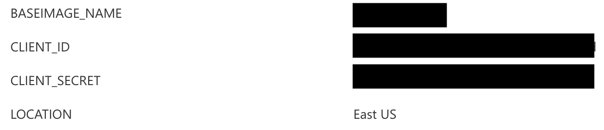

# How to setup the CI/CD pipeline through VSTS

## Build Variables

Create Build Variables and fill them with the required values.




## Set the Build Number Format


```
$(MajorVersion).$(MinorVersion).$(Date:yyMMdd)$(Rev:.r)
```

This will generate build numbers like `1.0.180506.1` and `1.0.180506.2` for each build per day and will reset on the next day like so `1.0.180507.1`.

When you do major changes, make sure to update the Major/Minor build variables accordingly.

## Build Pipeline

- Select Hosted Build Agent Linux

- Use a Shell task to run `ci/getpacker.sh`

- Use a Shell task to run `ci/runpacker.sh`


Configure build triggers as you wish.

When this runs, you should end up with a new VM image created in the Resource Group you specified.


## Release Pipeline

- Run the deployment with the updated image name

    ```sh
    az group create -n packervmssarm -l eastus
    az group deployment create -n deploypackervmssarm -g packervmssarm --template-file azuredeploy.json --parameters azuredeploy.parameters.json
    ```